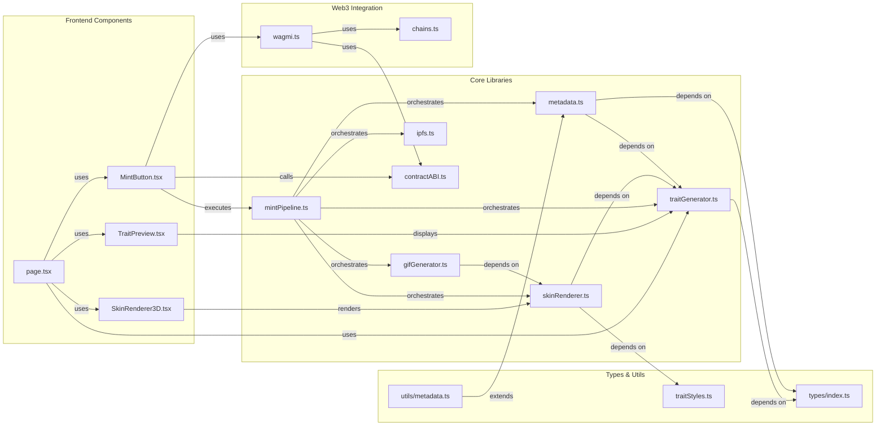
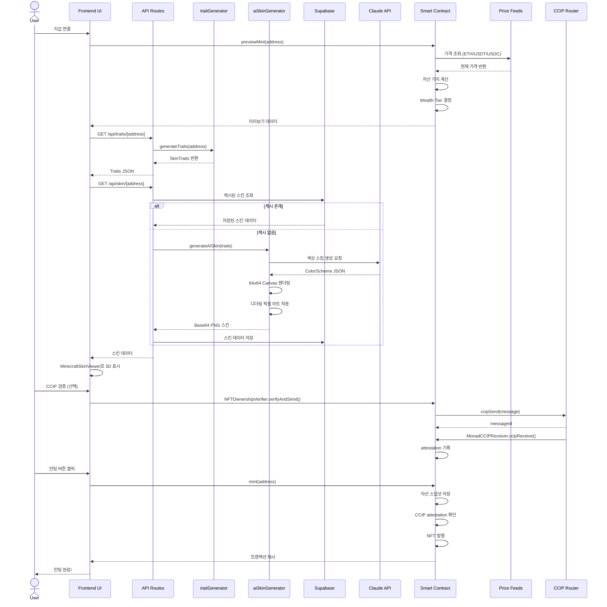
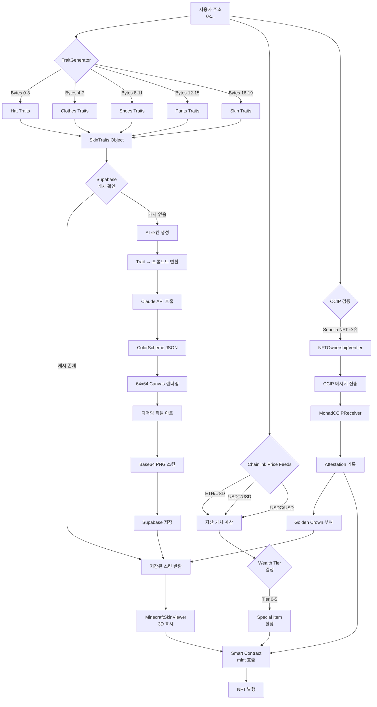
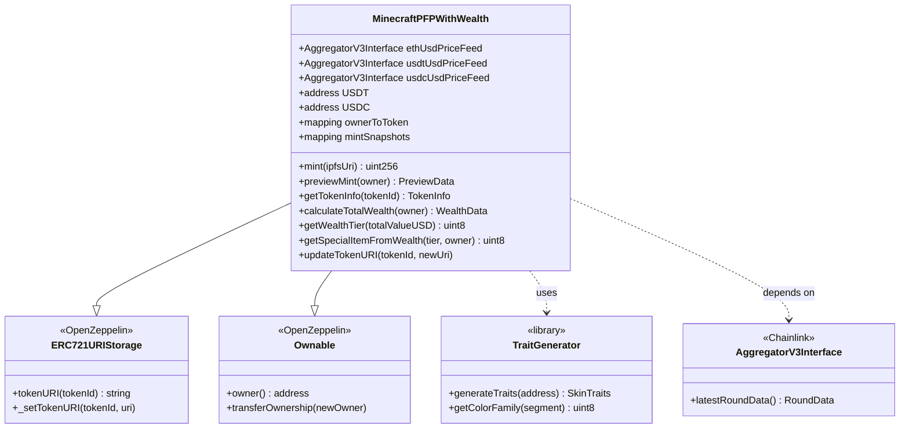
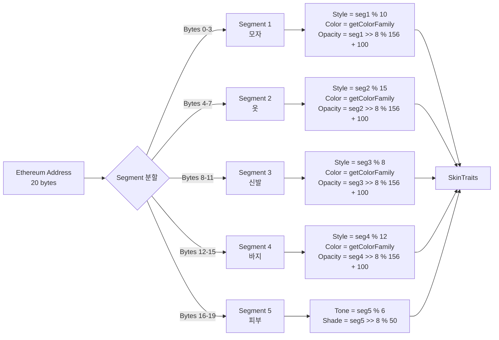
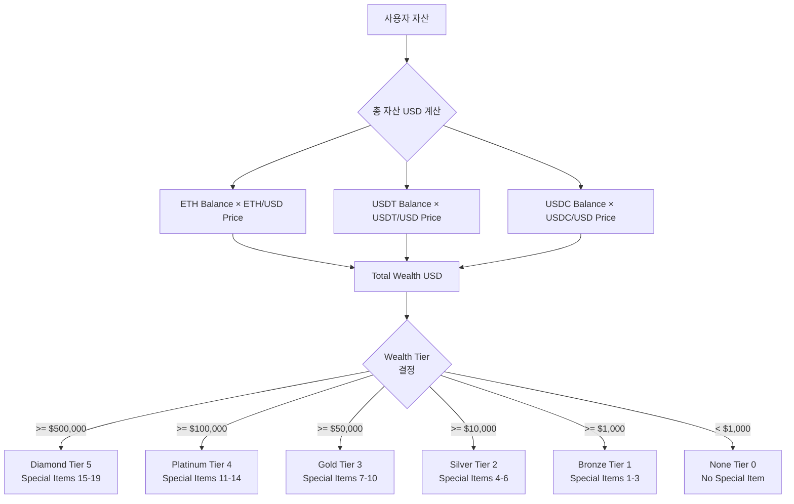
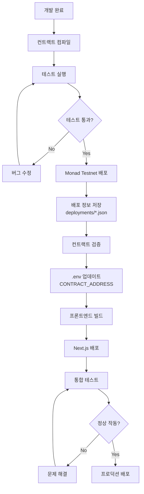

# Minecraft PFP NFT - 아키텍처 문서

## 프로젝트 개요

Minecraft 스타일의 PFP (Profile Picture) NFT 프로젝트로, 주소 기반 결정론적 속성 생성과 자산 등급 기반 특별 아이템을 제공합니다.

### 주요 기능
- ✅ **AI 기반 스킨 생성**: Claude Haiku 4.5를 사용한 픽셀 아트 스킨 자동 생성
- ✅ **Ethereum 주소 기반 결정론적 트레잇 생성**
- ✅ **Chainlink Price Feed를 통한 실시간 자산 가치 계산**
- ✅ **자산 등급(Wealth Tier)에 따른 특별 아이템 부여**
- ✅ **CCIP 크로스체인 검증**: Sepolia-Monad 간 NFT 소유권 검증
- ✅ **Supabase 데이터베이스**: 스킨 데이터 저장 및 캐싱
- ✅ **3D 모델 렌더링**: skinview3d를 통한 Minecraft 스킨 뷰어
- ✅ **OpenSea 호환 메타데이터**

---

## 시스템 아키텍처

```mermaid
graph TB
    subgraph "Frontend Layer - Next.js"
        A[page.tsx<br/>메인 UI]
        B[MintButton<br/>민팅 버튼]
        C[TraitPreview<br/>속성 미리보기]
        D[MinecraftSkinViewer<br/>3D 스킨 뷰어]
        E[SepoliaNFTVerification<br/>CCIP 검증 UI]
    end

    subgraph "API Routes"
        F[/api/traits<br/>Trait 조회]
        G[/api/skin<br/>스킨 생성]
        H[/api/dev<br/>개발 도구]
    end

    subgraph "Library Layer"
        I[traitGenerator.ts<br/>트레잇 생성]
        J[aiSkinGenerator.ts<br/>AI 스킨 생성]
        K[skinRenderer.ts<br/>3D 렌더링]
        L[mintPipeline.ts<br/>민팅 파이프라인]
        M[db/supabase.ts<br/>DB 클라이언트]
    end

    subgraph "Smart Contract Layer - Solidity"
        N[MinecraftPFPWithWealth.sol<br/>메인 NFT 컨트랙트]
        O[TraitGenerator.sol<br/>트레잇 라이브러리]
        P[NFTOwnershipVerifier.sol<br/>Sepolia CCIP 발신]
        Q[MonadCCIPReceiver.sol<br/>Monad CCIP 수신]
    end

    subgraph "External Services"
        R[Anthropic Claude API<br/>AI 스킨 생성]
        S[Supabase<br/>데이터베이스]
        T[Chainlink Price Feeds<br/>가격 데이터]
        U[Chainlink CCIP<br/>크로스체인 메시징]
        V[Monad Testnet<br/>블록체인]
    end

    A --> B
    A --> C
    A --> D
    A --> E
    A --> F
    B --> L
    C --> I
    D --> K
    E --> P
    F --> I
    G --> J
    G --> M
    L --> I
    L --> J
    L --> K
    L --> M
    J --> R
    M --> S
    N --> O
    N --> T
    P --> U
    Q --> U
    B --> N
    E --> P
    N --> V
    Q --> V
```

---

## 컴포넌트 의존성 그래프



---

## 민팅 프로세스 플로우



---

## 데이터 흐름도



---

## 스마트 컨트랙트 구조



---

## 트레잇 생성 알고리즘



---

## 자산 등급 시스템



---

## 파일 구조

```
minecraft-pfp/
├── contracts/                          # 스마트 컨트랙트
│   ├── MinecraftPFPWithWealth.sol      # 메인 NFT 컨트랙트
│   ├── TraitGenerator.sol              # 트레잇 생성 라이브러리
│   ├── sepolia/
│   │   └── NFTOwnershipVerifier.sol    # CCIP 발신자 (Sepolia)
│   └── monad/
│       └── MonadCCIPReceiver.sol       # CCIP 수신자 (Monad)
│
├── scripts/                            # 배포 스크립트
│   ├── deploy.js                       # 메인 컨트랙트 배포
│   └── deploy-ccip.js                  # CCIP 컨트랙트 배포
│
├── deployments/                        # 배포 정보 JSON
│   ├── ccip-sepolia.json
│   └── monad-penguins_sepolia_*.json
│
├── components/                         # 외부 컴포넌트 (CCIP UI 등)
│   ├── CCIPStatusMonitor.tsx
│   └── SepoliaNFTVerification.tsx
│
├── src/
│   ├── app/                           # Next.js 앱 라우터
│   │   ├── api/                       # API Routes
│   │   │   ├── traits/[address]/route.ts    # Trait 조회
│   │   │   ├── skin/[address]/route.ts      # AI 스킨 생성
│   │   │   └── dev/delete-skin/[address]/   # 개발 도구
│   │   ├── page.tsx                   # 메인 페이지
│   │   ├── layout.tsx                 # 레이아웃
│   │   └── providers.tsx              # Web3 프로바이더 설정
│   │
│   ├── components/                    # React 컴포넌트
│   │   ├── minecraft/                 # Minecraft UI 시스템
│   │   │   ├── BGPattern.tsx          # 배경 패턴
│   │   │   ├── MinecraftButton.tsx    # 버튼 스타일
│   │   │   └── MinecraftCard.tsx      # 카드 스타일
│   │   ├── MintButton.tsx             # 민팅 버튼
│   │   ├── TraitPreview.tsx           # 트레잇 미리보기
│   │   ├── MinecraftSkinViewer.tsx    # 3D 스킨 뷰어
│   │   └── SkinRenderer3D.tsx         # Three.js 렌더러
│   │
│   ├── lib/                           # 핵심 라이브러리
│   │   ├── traitGenerator.ts          # 주소 기반 트레잇 생성
│   │   ├── aiSkinGenerator.ts         # AI 스킨 생성 (Claude API)
│   │   ├── skinRenderer.ts            # 3D 모델 렌더링
│   │   ├── mintPipeline.ts            # 민팅 프로세스 관리
│   │   ├── gifGenerator.ts            # GIF 생성
│   │   ├── ipfs.ts                    # IPFS 업로드
│   │   ├── traitStyles.ts             # 트레잇 스타일 정의
│   │   ├── contractABI.ts             # 컨트랙트 ABI
│   │   ├── wagmi.ts                   # Wagmi 설정
│   │   ├── chains.ts                  # 체인 설정
│   │   ├── utils.ts                   # 유틸리티 함수
│   │   └── db/                        # Supabase 데이터베이스
│   │       ├── client.ts              # DB 클라이언트
│   │       ├── supabase.ts            # Supabase 초기화
│   │       └── migrations/            # 마이그레이션 스크립트
│   │
│   ├── types/                         # TypeScript 타입 정의
│   │   └── index.ts                   # 공통 타입
│   │
│   ├── utils/                         # 유틸리티 함수
│   │   └── metadata.ts                # 메타데이터 생성
│   │
│   └── config/                        # 설정 파일
│       └── monad.ts                   # Monad 네트워크 설정
│
├── claudedocs/                        # Claude 관련 문서
│   ├── supabase-setup-guide.md
│   ├── db-setup-guide.md
│   └── CCIP_CROSSCHAIN_IMPLEMENTATION_PLAN.md
│
├── docs/                              # 기술 문서
│   ├── ARCHITECTURE.md
│   ├── CROSSCHAIN_NFT.md
│   └── SKIN_GENERATION.md
│
├── test/                              # 테스트
│   └── MinecraftPFP.test.ts           # 컨트랙트 테스트
│
├── hardhat.config.ts                  # Hardhat 설정
├── package.json                       # 패키지 의존성
└── tsconfig.json                      # TypeScript 설정
```

---

## 핵심 모듈 상세

### 1. traitGenerator.ts

**목적**: Ethereum 주소를 20바이트로 나누어 각 부위의 트레잇을 결정론적으로 생성

**주요 함수**:
- `generateTraits(address)`: 주소로부터 전체 트레잇 생성
- `getColorFamily(segment)`: 세그먼트 값으로 색상 계열 결정
- `validateTraits(traits)`: 트레잇 유효성 검증

**의존성**:
- 없음 (순수 함수)

**호출자**:
- `page.tsx`: 미리보기용
- `/api/traits/[address]`: API 라우트
- `aiSkinGenerator.ts`: AI 프롬프트 생성
- `TraitPreview.tsx`: UI 표시

---

### 2. aiSkinGenerator.ts ✨

**목적**: Claude Haiku 4.5 AI를 사용하여 Trait 기반 픽셀 아트 스킨 자동 생성

**주요 함수**:
- `generateAISkin(traits, apiKey, hasCCIPAttestation)`: AI 스킨 생성 파이프라인
- `traitsToPrompt(traits)`: Trait를 AI 프롬프트로 변환
- `generateColorScheme(prompt, apiKey)`: Claude API로 색상 스킴 생성
- `renderSkinFromColorScheme(colorScheme)`: 64x64 Canvas 렌더링
- `renderGoldenCrown(ctx)`: CCIP attestation용 황금 왕관 렌더링
- `fillRectWithDithering()`: 디더링 픽셀 아트 효과

**특징**:
- **서버 전용**: API 키 보안을 위해 API Routes에서만 실행
- **UV 매핑 정확도**: 64x64 Minecraft 텍스처 레이아웃 완벽 지원
- **디더링 효과**: 하이라이트/쉐도우 색상으로 3D 깊이감 표현
- **CCIP 통합**: attestation 보유자에게 Golden Crown 추가

**의존성**:
- `@anthropic-ai/sdk`: Claude API 클라이언트
- `@napi-rs/canvas`: 서버사이드 Canvas API
- `traitGenerator`: Trait 데이터 및 스타일

**호출자**:
- `/api/skin/[address]`: 스킨 생성 API

---

### 3. db/supabase.ts 💾

**목적**: Supabase 데이터베이스 클라이언트 및 스킨 데이터 관리

**주요 함수**:
- `getSkinByAddress(address)`: 주소로 스킨 조회 (캐시)
- `saveSkin(address, skinData)`: 스킨 데이터 저장
- `deleteSkin(address)`: 스킨 삭제 (개발용)

**스키마**:
```sql
CREATE TABLE skins (
  id SERIAL PRIMARY KEY,
  address TEXT UNIQUE NOT NULL,
  skin_data TEXT NOT NULL,  -- Base64 PNG
  created_at TIMESTAMP DEFAULT NOW()
);
```

**의존성**:
- `@supabase/supabase-js`: Supabase 클라이언트
- 환경변수: `NEXT_PUBLIC_SUPABASE_URL`, `NEXT_PUBLIC_SUPABASE_ANON_KEY`

**호출자**:
- `/api/skin/[address]`: 캐시 조회 및 저장
- `/api/dev/delete-skin/[address]`: 삭제 (개발용)

---

### 4. skinRenderer.ts

**목적**: Three.js를 사용하여 마인크래프트 스킨 텍스처 생성 및 3D 렌더링

**주요 함수**:
- `createSkinTexture(traits)`: 64x64 텍스처 캔버스 생성
- `createMinecraftScene()`: Three.js 씬, 카메라, 렌더러 설정
- `captureAnimationFrames()`: 360도 회전 애니메이션 프레임 캡처
- `disposeScene()`: 메모리 정리

**의존성**:
- `three`: 3D 렌더링
- `traitGenerator`: 트레잇 데이터
- `traitStyles`: 색상 스타일

**호출자**:
- `mintPipeline.ts`: GIF 생성용
- `SkinRenderer3D.tsx`: 실시간 미리보기

---

### 5. mintPipeline.ts

**목적**: 전체 민팅 프로세스를 순차적으로 실행하는 오케스트레이터

**주요 함수**:
- `executeMintPipeline(options)`: 전체 민팅 파이프라인 실행
  1. 트레잇 생성
  2. 스킨 텍스처 생성
  3. 3D 씬 설정
  4. 애니메이션 프레임 캡처
  5. GIF 생성
  6. GIF IPFS 업로드
  7. 메타데이터 생성
  8. 메타데이터 IPFS 업로드
  9. 리소스 정리
- `executePreviewPipeline(address)`: 미리보기용 간소화 버전

**의존성**:
- `traitGenerator`: 트레잇 생성
- `skinRenderer`: 3D 렌더링
- `gifGenerator`: GIF 인코딩
- `ipfs`: IPFS 업로드
- `metadata`: 메타데이터 생성

**호출자**:
- `MintButton.tsx`: 민팅 버튼 클릭 시

---

### 6. gifGenerator.ts

**목적**: 캡처된 프레임들을 GIF로 인코딩

**주요 함수**:
- `generateGIF(frames, width, height, fps)`: ImageData 배열을 GIF Blob으로 변환
- `blobToArrayBuffer(blob)`: Blob을 ArrayBuffer로 변환
- `blobToBase64(blob)`: Blob을 Base64로 변환

**의존성**:
- `gif.js`: GIF 인코딩 라이브러리

**호출자**:
- `mintPipeline.ts`: 민팅 프로세스 중

---

### 7. ipfs.ts

**목적**: Pinata를 통한 IPFS 업로드 및 조회

**주요 함수**:
- `createPinataClient()`: Pinata SDK 인스턴스 생성
- `uploadGIFToIPFS(blob, filename)`: GIF 파일 업로드
- `uploadMetadataToIPFS(metadata)`: 메타데이터 JSON 업로드
- `getIPFSUrl(cid)`: HTTP 게이트웨이 URL 생성
- `getIPFSUri(cid)`: ipfs:// URI 생성

**의존성**:
- `pinata-web3`: Pinata SDK
- 환경변수: `NEXT_PUBLIC_PINATA_JWT`, `NEXT_PUBLIC_PINATA_GATEWAY`

**호출자**:
- `mintPipeline.ts`: GIF 및 메타데이터 업로드

---

### 8. MinecraftPFPWithWealth.sol

**목적**: ERC721 NFT 컨트랙트 + 자산 기반 특별 아이템

**주요 기능**:
- `mint(ipfsUri)`: NFT 발행 및 자산 스냅샷 저장
- `previewMint(owner)`: 민팅 전 미리보기 데이터
- `calculateTotalWealth(owner)`: ETH, USDT, USDC 자산 가치 계산
- `getWealthTier(totalValueUSD)`: 자산 등급 결정
- `getSpecialItemFromWealth(tier, owner)`: 특별 아이템 ID 생성
- `getTokenInfo(tokenId)`: 토큰 전체 정보 조회
- `updateTokenURI(tokenId, newUri)`: URI 업데이트

**의존성**:
- `@openzeppelin/contracts`: ERC721URIStorage, Ownable
- `@chainlink/contracts`: AggregatorV3Interface
- `TraitGenerator.sol`: 트레잇 생성 라이브러리

**외부 서비스**:
- Chainlink Price Feeds (ETH/USD, USDT/USD, USDC/USD)
- USDT, USDC 토큰 컨트랙트

---

### 9. TraitGenerator.sol

**목적**: 주소 기반 결정론적 트레잇 생성 (온체인)

**주요 기능**:
- `generateTraits(address)`: 주소를 5개 세그먼트로 나누어 트레잇 생성
- `getColorFamily(segment)`: 나눗셈 체크를 통한 색상 계열 결정

**특징**:
- Library로 구현 (MinecraftPFPWithWealth에서 using으로 사용)
- 순수 함수 (pure)
- Gas 효율적인 비트 연산 사용

---

### 10. NFTOwnershipVerifier.sol (Sepolia) 🌉

**목적**: Sepolia에서 NFT 소유권을 검증하고 CCIP 메시지를 Monad로 전송

**주요 기능**:
- `verifyAndSend(nftContract, monadAddress)`: NFT 소유 확인 후 CCIP 메시지 전송
- `_buildCCIPMessage(monadAddress)`: CCIP 메시지 구성
- `withdrawToken(beneficiary, token)`: LINK 토큰 인출

**CCIP 설정**:
- Router: Sepolia CCIP Router
- Destination: Monad Testnet Chain Selector
- Fees: LINK 토큰으로 결제

**의존성**:
- `@chainlink/contracts-ccip`: CCIP 인터페이스
- LINK 토큰 (Sepolia)

---

### 11. MonadCCIPReceiver.sol (Monad) 🌉

**목적**: Monad에서 CCIP 메시지를 수신하고 attestation 기록

**주요 기능**:
- `ccipReceive(message)`: CCIP 메시지 수신 및 attestation 저장
- `hasAttestation(address)`: 주소의 attestation 여부 확인
- `getAttestationTimestamp(address)`: attestation 시점 조회

**스토리지**:
```solidity
mapping(address => bool) public attestations;
mapping(address => uint256) public attestationTimestamps;
```

**의존성**:
- `@chainlink/contracts-ccip`: CCIPReceiver 베이스
- `@openzeppelin/contracts`: Ownable

**특전**:
- Golden Crown: AI 스킨 생성 시 황금 왕관 렌더링

---

## 기술 스택

### AI & Backend
- **AI Engine**: Anthropic Claude Haiku 4.5 (AI 스킨 생성)
- **Database**: Supabase (PostgreSQL)
- **Server-side Rendering**: @napi-rs/canvas (Node.js Canvas API)
- **Runtime**: Next.js API Routes (서버리스)

### Frontend
- **Framework**: Next.js 14 (App Router)
- **UI Library**: React 18
- **Styling**: Tailwind CSS + clsx + tailwind-merge
- **3D Rendering**: Three.js, @react-three/fiber, @react-three/drei
- **Minecraft Viewer**: skinview3d
- **State Management**: TanStack Query (React Query)

### Web3
- **Wallet Connection**: RainbowKit 2.0
- **Contract Interaction**: Wagmi 2.0, Viem 2.0
- **Networks**:
  - Monad Testnet (메인)
  - Ethereum Sepolia Testnet (CCIP)

### Smart Contracts
- **Language**: Solidity 0.8.20
- **Framework**: Hardhat
- **Libraries**:
  - OpenZeppelin Contracts 5.0
  - Chainlink Contracts (Price Feeds, CCIP)
- **Oracle**: Chainlink Price Feeds
- **Cross-chain**: Chainlink CCIP

### Storage
- **Database**: Supabase (스킨 캐싱)
- **File Storage**: Supabase Storage (옵션)

### Media Processing
- **Image Processing**: @napi-rs/canvas (서버), Canvas API (클라이언트)
- **GIF Encoding**: gif.js
- **3D Graphics**: Three.js

---

## 환경 변수

```env
# Blockchain
PRIVATE_KEY=                              # 배포자 개인 키
MONAD_TESTNET_RPC_URL=                    # Monad Testnet RPC
SEPOLIA_RPC_URL=                          # Sepolia RPC (CCIP용)

# AI
ANTHROPIC_API_KEY=                        # Anthropic Claude API 키

# Database (Supabase)
NEXT_PUBLIC_SUPABASE_URL=                 # Supabase 프로젝트 URL
NEXT_PUBLIC_SUPABASE_ANON_KEY=            # Supabase 익명 키
SUPABASE_SERVICE_ROLE_KEY=                # Supabase 서비스 롤 키 (서버 전용)

# Contract Addresses
NEXT_PUBLIC_CONTRACT_ADDRESS=             # MinecraftPFP 컨트랙트 (Monad)
NEXT_PUBLIC_SEPOLIA_VERIFIER_ADDRESS=     # NFTOwnershipVerifier (Sepolia)
NEXT_PUBLIC_MONAD_RECEIVER_ADDRESS=       # MonadCCIPReceiver (Monad)

# Contract Verification
MONAD_API_KEY=                            # Monad Explorer API 키
ETHERSCAN_API_KEY=                        # Etherscan API 키

# CCIP (선택)
SEPOLIA_CCIP_ROUTER=                      # Sepolia CCIP Router 주소
MONAD_CHAIN_SELECTOR=                     # Monad Chain Selector
```

---

## 배포 프로세스



---

## 보안 고려사항

### 스마트 컨트랙트
1. **Price Feed 검증**
   - Chainlink Price Feed의 freshness 체크 (1시간 이내)
   - 가격이 0보다 큰지 검증

2. **중복 민팅 방지**
   - `ownerToToken` 매핑으로 주소당 1개만 민팅 가능
   - 민팅 전 체크: `require(ownerToToken[msg.sender] == 0)`

3. **입력 검증**
   - IPFS URI 비어있지 않은지 확인
   - 토큰 존재 여부 확인

### 프론트엔드
1. **API 키 보호**
   - `NEXT_PUBLIC_` 접두사로 클라이언트 노출 제어
   - 민감한 키는 서버 사이드에서만 사용

2. **트랜잭션 안전성**
   - wagmi의 `useWaitForTransactionReceipt`로 트랜잭션 확인
   - 에러 처리 및 사용자 피드백

---

## 성능 최적화

### 3D 렌더링
- WebGL 렌더러 사용
- 필요한 경우에만 리소스 할당
- `disposeScene`으로 메모리 정리

### GIF 생성
- Web Worker 사용 (gif.js)
- 프레임 수 조정 가능 (기본 60프레임)

### IPFS 업로드
- 병렬 업로드 불가능 (순차 처리)
- 진행 상황 사용자에게 표시

---

## 향후 개선 사항

1. **특별 아이템 3D 렌더링**
   - 현재는 메타데이터에만 포함
   - 실제 3D 모델에 아이템 표시

2. **배치 민팅**
   - 현재는 주소당 1개
   - 여러 개 민팅 기능 추가 가능

3. **메타데이터 업데이트**
   - 사용자가 자산 증가 시 특별 아이템 업그레이드
   - `updateTokenURI` 기능 활용

4. **성능 모니터링**
   - GIF 생성 시간 추적
   - IPFS 업로드 시간 추적
   - 트랜잭션 가스비 최적화

---

## 참고 자료

- [OpenZeppelin Contracts](https://docs.openzeppelin.com/contracts)
- [Chainlink Price Feeds](https://docs.chain.link/data-feeds/price-feeds)
- [Three.js Documentation](https://threejs.org/docs/)
- [IPFS Documentation](https://docs.ipfs.tech/)
- [Wagmi Documentation](https://wagmi.sh/)
- [Monad Documentation](https://docs.monad.xyz/)
