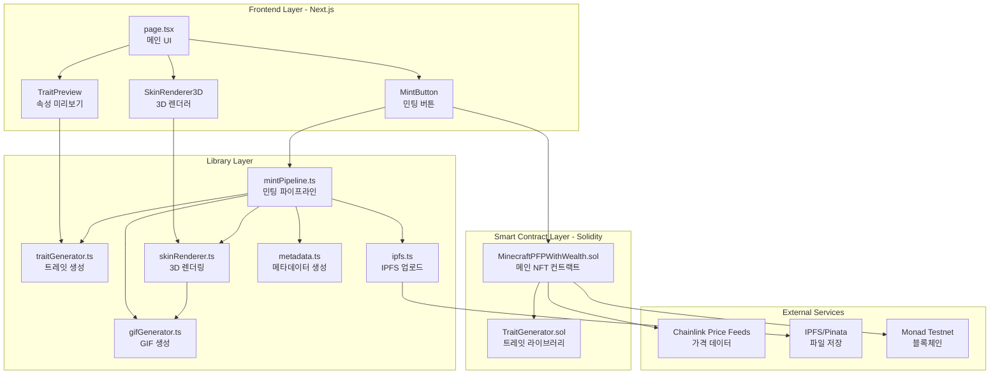
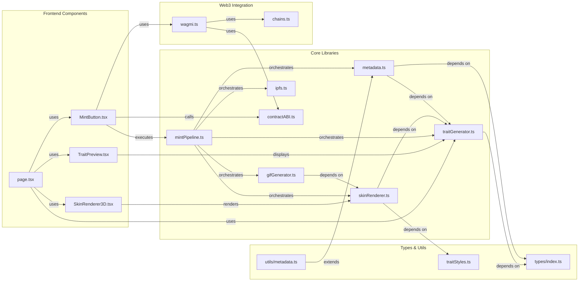
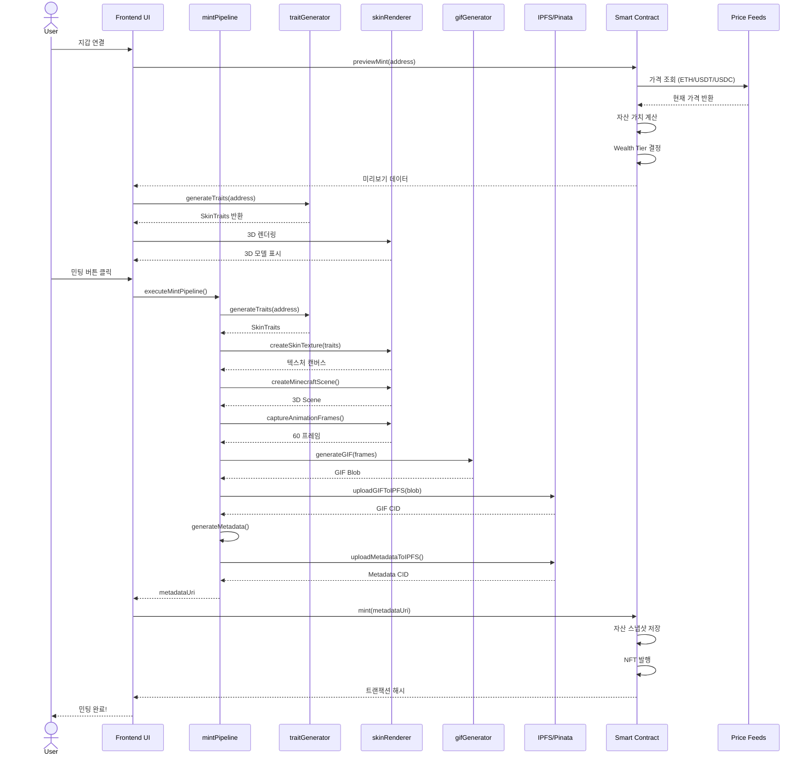
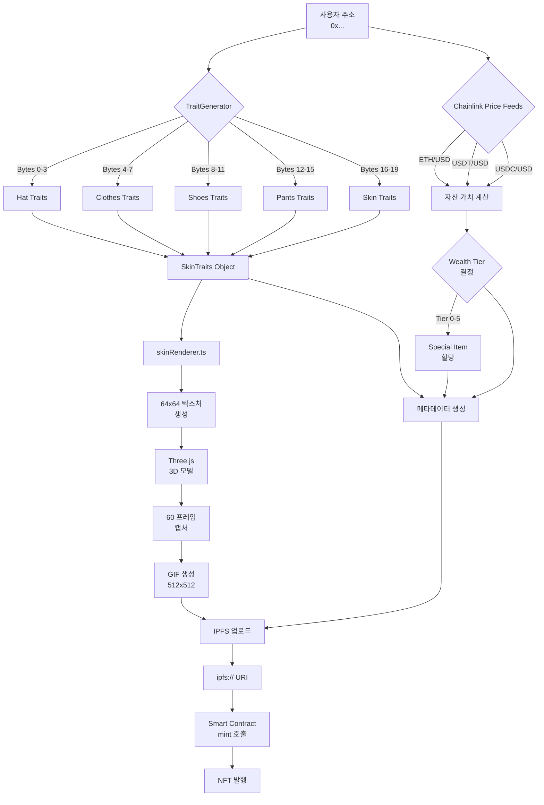
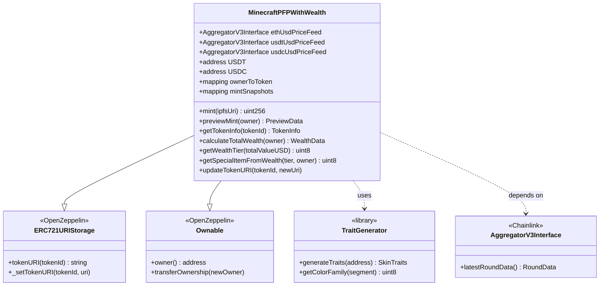
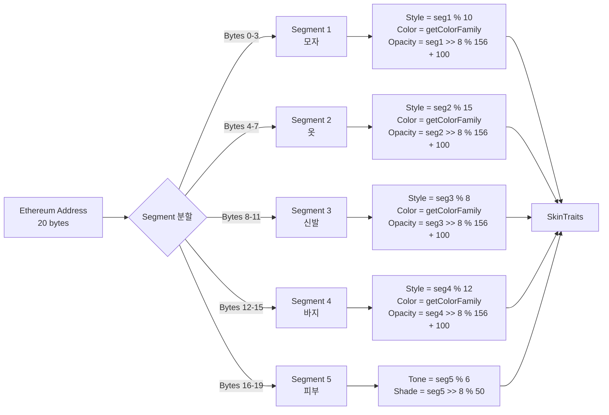
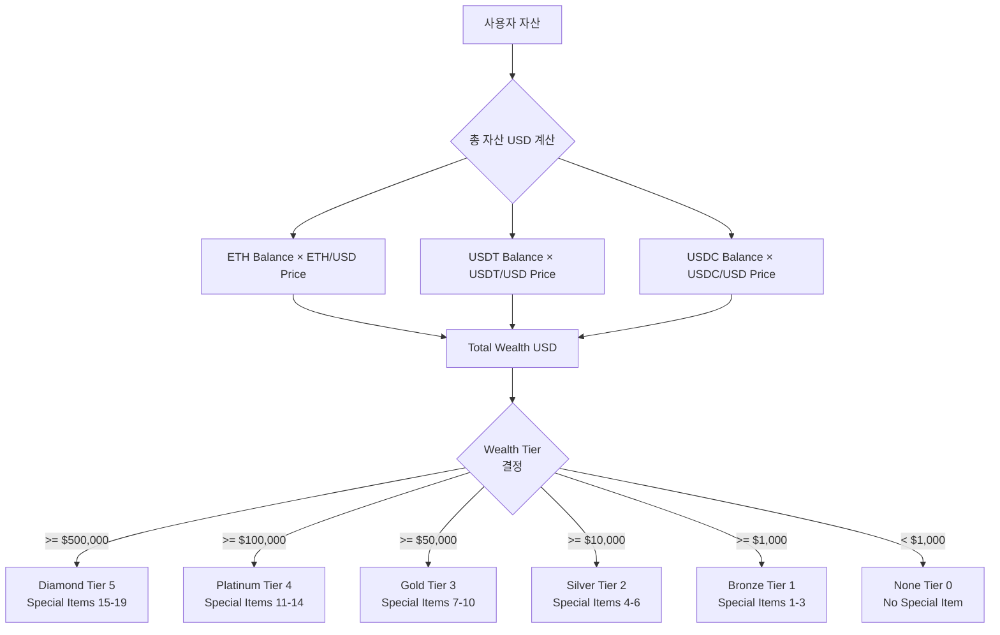
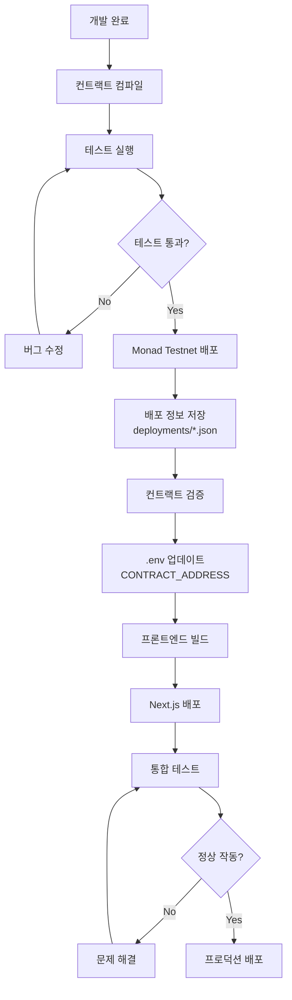

# Minecraft PFP NFT - 아키텍처 문서

## 프로젝트 개요

Minecraft 스타일의 PFP (Profile Picture) NFT 프로젝트로, 주소 기반 결정론적 속성 생성과 자산 등급 기반 특별 아이템을 제공합니다.

### 주요 기능
- ✅ Ethereum 주소 기반 결정론적 트레잇 생성
- ✅ Chainlink Price Feed를 통한 실시간 자산 가치 계산
- ✅ 자산 등급(Wealth Tier)에 따른 특별 아이템 부여
- ✅ 3D 모델 렌더링 및 애니메이션 GIF 생성
- ✅ IPFS를 통한 탈중앙화 스토리지
- ✅ OpenSea 호환 메타데이터

---

## 시스템 아키텍처



---

## 컴포넌트 의존성 그래프



---

## 민팅 프로세스 플로우



---

## 데이터 흐름도



---

## 스마트 컨트랙트 구조



---

## 트레잇 생성 알고리즘



---

## 자산 등급 시스템



---

## 파일 구조

```
minecraft-pfp/
├── contracts/                      # 스마트 컨트랙트
│   ├── MinecraftPFPWithWealth.sol  # 메인 NFT 컨트랙트
│   └── TraitGenerator.sol          # 트레잇 생성 라이브러리
│
├── scripts/                        # 배포 스크립트
│   └── deploy.ts                   # 컨트랙트 배포 스크립트
│
├── src/
│   ├── app/                        # Next.js 앱 라우터
│   │   ├── page.tsx                # 메인 페이지
│   │   ├── layout.tsx              # 레이아웃
│   │   └── providers.tsx           # Web3 프로바이더 설정
│   │
│   ├── components/                 # React 컴포넌트
│   │   ├── MintButton.tsx          # 민팅 버튼 컴포넌트
│   │   ├── TraitPreview.tsx        # 트레잇 미리보기
│   │   └── SkinRenderer3D.tsx      # 3D 렌더러 컴포넌트
│   │
│   ├── lib/                        # 핵심 라이브러리
│   │   ├── traitGenerator.ts       # 주소 기반 트레잇 생성
│   │   ├── skinRenderer.ts         # 3D 모델 렌더링
│   │   ├── mintPipeline.ts         # 민팅 프로세스 관리
│   │   ├── gifGenerator.ts         # GIF 생성
│   │   ├── ipfs.ts                 # IPFS 업로드
│   │   ├── traitStyles.ts          # 트레잇 스타일 정의
│   │   ├── contractABI.ts          # 컨트랙트 ABI
│   │   ├── wagmi.ts                # Wagmi 설정
│   │   └── chains.ts               # 체인 설정
│   │
│   ├── types/                      # TypeScript 타입 정의
│   │   └── index.ts                # 공통 타입
│   │
│   ├── utils/                      # 유틸리티 함수
│   │   └── metadata.ts             # 메타데이터 생성
│   │
│   └── config/                     # 설정 파일
│       └── monad.ts                # Monad 네트워크 설정
│
├── test/                           # 테스트
│   └── MinecraftPFP.test.ts        # 컨트랙트 테스트
│
├── hardhat.config.ts               # Hardhat 설정
├── package.json                    # 패키지 의존성
└── tsconfig.json                   # TypeScript 설정
```

---

## 핵심 모듈 상세

### 1. traitGenerator.ts

**목적**: Ethereum 주소를 20바이트로 나누어 각 부위의 트레잇을 결정론적으로 생성

**주요 함수**:
- `generateTraits(address)`: 주소로부터 전체 트레잇 생성
- `getColorFamily(segment)`: 세그먼트 값으로 색상 계열 결정
- `validateTraits(traits)`: 트레잇 유효성 검증

**의존성**:
- 없음 (순수 함수)

**호출자**:
- `page.tsx`: 미리보기용
- `mintPipeline.ts`: 민팅 시
- `TraitPreview.tsx`: UI 표시

---

### 2. skinRenderer.ts

**목적**: Three.js를 사용하여 마인크래프트 스킨 텍스처 생성 및 3D 렌더링

**주요 함수**:
- `createSkinTexture(traits)`: 64x64 텍스처 캔버스 생성
- `createMinecraftScene()`: Three.js 씬, 카메라, 렌더러 설정
- `captureAnimationFrames()`: 360도 회전 애니메이션 프레임 캡처
- `disposeScene()`: 메모리 정리

**의존성**:
- `three`: 3D 렌더링
- `traitGenerator`: 트레잇 데이터
- `traitStyles`: 색상 스타일

**호출자**:
- `mintPipeline.ts`: GIF 생성용
- `SkinRenderer3D.tsx`: 실시간 미리보기

---

### 3. mintPipeline.ts

**목적**: 전체 민팅 프로세스를 순차적으로 실행하는 오케스트레이터

**주요 함수**:
- `executeMintPipeline(options)`: 전체 민팅 파이프라인 실행
  1. 트레잇 생성
  2. 스킨 텍스처 생성
  3. 3D 씬 설정
  4. 애니메이션 프레임 캡처
  5. GIF 생성
  6. GIF IPFS 업로드
  7. 메타데이터 생성
  8. 메타데이터 IPFS 업로드
  9. 리소스 정리
- `executePreviewPipeline(address)`: 미리보기용 간소화 버전

**의존성**:
- `traitGenerator`: 트레잇 생성
- `skinRenderer`: 3D 렌더링
- `gifGenerator`: GIF 인코딩
- `ipfs`: IPFS 업로드
- `metadata`: 메타데이터 생성

**호출자**:
- `MintButton.tsx`: 민팅 버튼 클릭 시

---

### 4. gifGenerator.ts

**목적**: 캡처된 프레임들을 GIF로 인코딩

**주요 함수**:
- `generateGIF(frames, width, height, fps)`: ImageData 배열을 GIF Blob으로 변환
- `blobToArrayBuffer(blob)`: Blob을 ArrayBuffer로 변환
- `blobToBase64(blob)`: Blob을 Base64로 변환

**의존성**:
- `gif.js`: GIF 인코딩 라이브러리

**호출자**:
- `mintPipeline.ts`: 민팅 프로세스 중

---

### 5. ipfs.ts

**목적**: Pinata를 통한 IPFS 업로드 및 조회

**주요 함수**:
- `createPinataClient()`: Pinata SDK 인스턴스 생성
- `uploadGIFToIPFS(blob, filename)`: GIF 파일 업로드
- `uploadMetadataToIPFS(metadata)`: 메타데이터 JSON 업로드
- `getIPFSUrl(cid)`: HTTP 게이트웨이 URL 생성
- `getIPFSUri(cid)`: ipfs:// URI 생성

**의존성**:
- `pinata-web3`: Pinata SDK
- 환경변수: `NEXT_PUBLIC_PINATA_JWT`, `NEXT_PUBLIC_PINATA_GATEWAY`

**호출자**:
- `mintPipeline.ts`: GIF 및 메타데이터 업로드

---

### 6. MinecraftPFPWithWealth.sol

**목적**: ERC721 NFT 컨트랙트 + 자산 기반 특별 아이템

**주요 기능**:
- `mint(ipfsUri)`: NFT 발행 및 자산 스냅샷 저장
- `previewMint(owner)`: 민팅 전 미리보기 데이터
- `calculateTotalWealth(owner)`: ETH, USDT, USDC 자산 가치 계산
- `getWealthTier(totalValueUSD)`: 자산 등급 결정
- `getSpecialItemFromWealth(tier, owner)`: 특별 아이템 ID 생성
- `getTokenInfo(tokenId)`: 토큰 전체 정보 조회
- `updateTokenURI(tokenId, newUri)`: URI 업데이트

**의존성**:
- `@openzeppelin/contracts`: ERC721URIStorage, Ownable
- `@chainlink/contracts`: AggregatorV3Interface
- `TraitGenerator.sol`: 트레잇 생성 라이브러리

**외부 서비스**:
- Chainlink Price Feeds (ETH/USD, USDT/USD, USDC/USD)
- USDT, USDC 토큰 컨트랙트

---

### 7. TraitGenerator.sol

**목적**: 주소 기반 결정론적 트레잇 생성 (온체인)

**주요 기능**:
- `generateTraits(address)`: 주소를 5개 세그먼트로 나누어 트레잇 생성
- `getColorFamily(segment)`: 나눗셈 체크를 통한 색상 계열 결정

**특징**:
- Library로 구현 (MinecraftPFPWithWealth에서 using으로 사용)
- 순수 함수 (pure)
- Gas 효율적인 비트 연산 사용

---

## 기술 스택

### Frontend
- **Framework**: Next.js 14 (App Router)
- **UI Library**: React 18
- **Styling**: Tailwind CSS
- **3D Rendering**: Three.js + @react-three/fiber
- **State Management**: React Hooks

### Web3
- **Wallet Connection**: RainbowKit 2.0
- **Contract Interaction**: Wagmi 2.0, Viem 2.0
- **Blockchain**: Monad Testnet (EVM-compatible)

### Smart Contracts
- **Language**: Solidity 0.8.20
- **Framework**: Hardhat
- **Libraries**: OpenZeppelin Contracts 5.0
- **Oracle**: Chainlink Price Feeds

### Storage
- **Decentralized Storage**: IPFS
- **Provider**: Pinata

### Media Processing
- **Image Processing**: Canvas API
- **GIF Encoding**: gif.js
- **3D Graphics**: Three.js

---

## 환경 변수

```env
# Blockchain
PRIVATE_KEY=                        # 배포자 개인 키
MONAD_TESTNET_RPC_URL=              # Monad Testnet RPC
SEPOLIA_RPC_URL=                    # Sepolia RPC (테스트용)
MAINNET_RPC_URL=                    # Mainnet RPC (프로덕션)

# Contract Verification
MONAD_API_KEY=                      # Monad Explorer API 키
ETHERSCAN_API_KEY=                  # Etherscan API 키

# IPFS
NEXT_PUBLIC_PINATA_JWT=             # Pinata JWT 토큰
NEXT_PUBLIC_PINATA_GATEWAY=         # Pinata 게이트웨이 URL

# Deployed Contract
NEXT_PUBLIC_CONTRACT_ADDRESS=       # 배포된 컨트랙트 주소
```

---

## 배포 프로세스



---

## 보안 고려사항

### 스마트 컨트랙트
1. **Price Feed 검증**
   - Chainlink Price Feed의 freshness 체크 (1시간 이내)
   - 가격이 0보다 큰지 검증

2. **중복 민팅 방지**
   - `ownerToToken` 매핑으로 주소당 1개만 민팅 가능
   - 민팅 전 체크: `require(ownerToToken[msg.sender] == 0)`

3. **입력 검증**
   - IPFS URI 비어있지 않은지 확인
   - 토큰 존재 여부 확인

### 프론트엔드
1. **API 키 보호**
   - `NEXT_PUBLIC_` 접두사로 클라이언트 노출 제어
   - 민감한 키는 서버 사이드에서만 사용

2. **트랜잭션 안전성**
   - wagmi의 `useWaitForTransactionReceipt`로 트랜잭션 확인
   - 에러 처리 및 사용자 피드백

---

## 성능 최적화

### 3D 렌더링
- WebGL 렌더러 사용
- 필요한 경우에만 리소스 할당
- `disposeScene`으로 메모리 정리

### GIF 생성
- Web Worker 사용 (gif.js)
- 프레임 수 조정 가능 (기본 60프레임)

### IPFS 업로드
- 병렬 업로드 불가능 (순차 처리)
- 진행 상황 사용자에게 표시

---

## 향후 개선 사항

1. **특별 아이템 3D 렌더링**
   - 현재는 메타데이터에만 포함
   - 실제 3D 모델에 아이템 표시

2. **배치 민팅**
   - 현재는 주소당 1개
   - 여러 개 민팅 기능 추가 가능

3. **메타데이터 업데이트**
   - 사용자가 자산 증가 시 특별 아이템 업그레이드
   - `updateTokenURI` 기능 활용

4. **성능 모니터링**
   - GIF 생성 시간 추적
   - IPFS 업로드 시간 추적
   - 트랜잭션 가스비 최적화

---

## 참고 자료

- [OpenZeppelin Contracts](https://docs.openzeppelin.com/contracts)
- [Chainlink Price Feeds](https://docs.chain.link/data-feeds/price-feeds)
- [Three.js Documentation](https://threejs.org/docs/)
- [IPFS Documentation](https://docs.ipfs.tech/)
- [Wagmi Documentation](https://wagmi.sh/)
- [Monad Documentation](https://docs.monad.xyz/)
