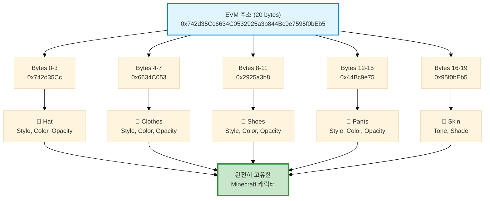
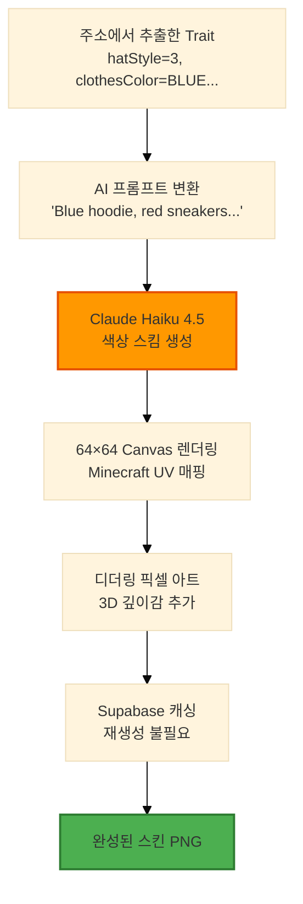
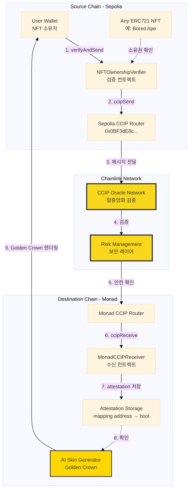
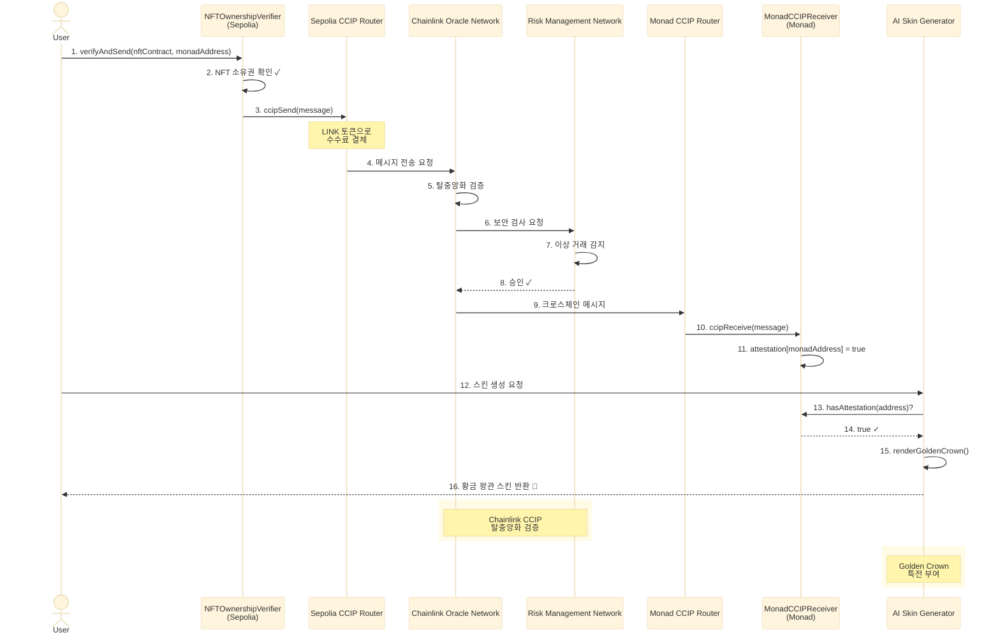
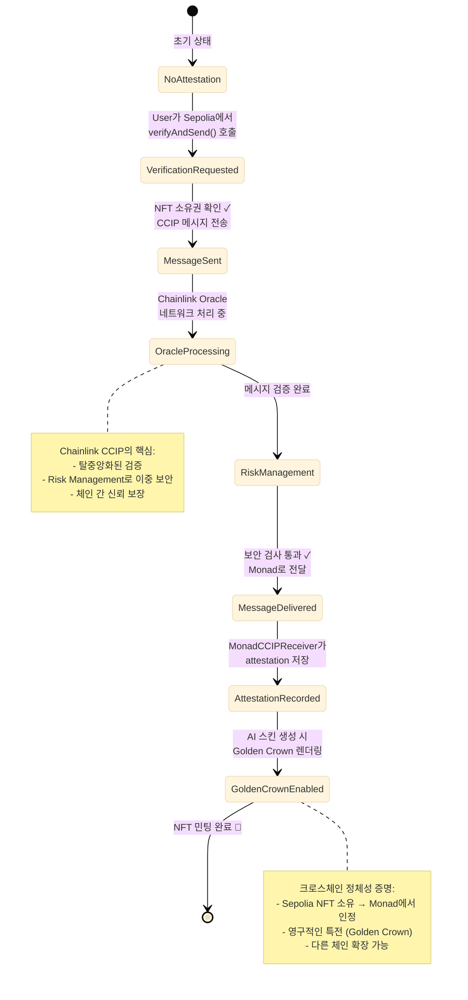
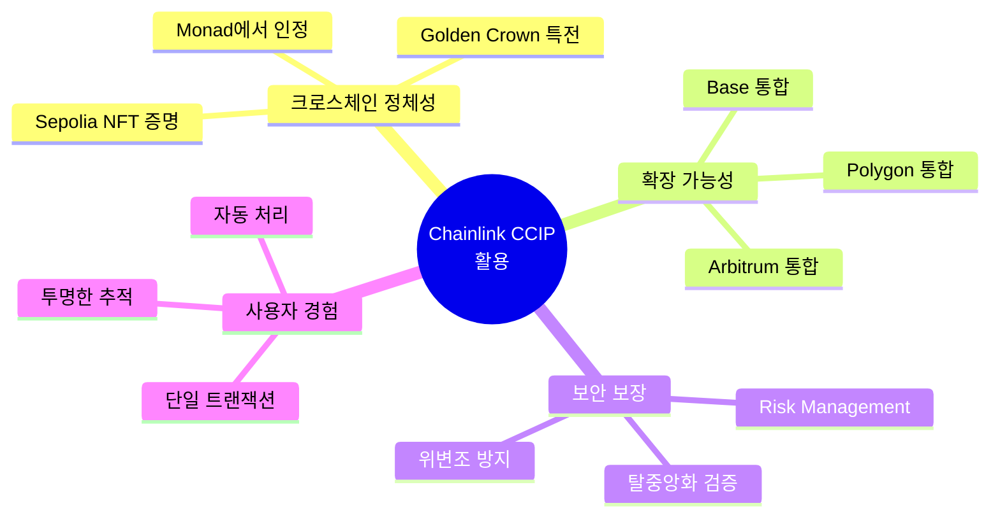

# 🎮 Minecraft PFP NFT
## AI + Chainlink로 만드는 재미있는 크로스체인 NFT

**Monad Blitz Hackathon 2025**

---

## 🎯 한 줄 요약

> "당신의 지갑 주소로 생성된 고유한 Minecraft 캐릭터 NFT에,
> **Chainlink CCIP**로 다른 체인의 NFT를 검증하면 **황금 왕관**을 씌워드립니다!"

---

## 💡 프로젝트 배경

### 기존 PFP NFT의 문제점
- ❌ 랜덤 생성 → 동일 지갑으로 다른 NFT 발행 가능
- ❌ 단일 체인에 갇힌 정체성
- ❌ 정적인 메타데이터

### 우리의 솔루션
- ✅ **결정론적 생성**: 같은 주소 = 같은 캐릭터
- ✅ **크로스체인 검증**: Chainlink CCIP로 다른 체인 자산 증명
- ✅ **동적 특전**: 자산 등급에 따른 특별 아이템

---

## 🎲 핵심 아이디어: 주소 = 운명

### "당신의 지갑 주소가 곧 당신의 캐릭터입니다"

**결정론적 생성 (Deterministic Generation)**
- 같은 주소 → 언제나 같은 캐릭터
- 수학적으로 보장된 유일성
- 랜덤 없음, 예측 가능, 재생성 가능

---

## 🧬 EVM 주소 → Trait 변환 원리

### 20 Bytes 주소를 5개 세그먼트로 분할



---

## 🔢 Trait 생성 알고리즘

### 각 세그먼트를 uint32로 변환 후 속성 결정

```solidity
// 예시: Hat Traits 생성
bytes4 segment1 = bytes4(address)[0:4];  // 0x742d35Cc
uint32 value = uint32(segment1);         // 1949128140

// 속성 추출
hatStyle = value % 10;                    // 0-9 (10가지 스타일)
hatColor = getColorFamily(value);         // 0-5 (6가지 색상 계열)
hatOpacity = (value >> 8) % 156 + 100;   // 100-255 (투명도)
```

### 색상 계열 결정 (소수 체크)

```solidity
function getColorFamily(uint32 segment) pure returns (uint8) {
    if (segment % 3 == 0) return BLUE;      // 파란색 계열
    if (segment % 5 == 0) return YELLOW;    // 노란색 계열
    if (segment % 7 == 0) return RED;       // 빨간색 계열
    if (segment % 11 == 0) return GREEN;    // 초록색 계열
    if (segment % 13 == 0) return PURPLE;   // 보라색 계열
    return NEUTRAL;                         // 중립 (회색/갈색)
}
```

---

## 🎨 Trait → AI 스킨 생성

### 결정론적 Trait를 AI가 시각화



---

## ⭐ 핵심 기능 #1: Chainlink Data Feeds

### 자산 기반 Wealth Tier 시스템

**문제**: NFT에 사용자의 "부"를 어떻게 반영할까?

**해결**: Chainlink Price Feeds로 실시간 자산 가치 계산!

```solidity
// SOL 잔액을 USD로 환산
function calculateTotalWealth(address owner) public view returns (
    uint256 solBalance,,
    uint256 totalValueUSD
) {
    // Chainlink Price Feed 조회
    (, int256 solPrice,,,) = solUsdPriceFeed.latestRoundData(););

    // USD 가치 계산
    totalValueUSD = (solPrice) + ...;
}
```

**Wealth Tier에 따른 특별 아이템 부여**
- 💎 Diamond ($500K+): Elytra, Netherite Armor
- 🥇 Platinum ($100K+): Diamond Sword, Enchanted Bow
- 🥈 Gold ($50K+): Iron Armor, Golden Apple
- 🥉 Silver ($10K+): Bow, Shield

---

## ⭐ 핵심 기능 #2: Chainlink CCIP 🌟

### 크로스체인 NFT 검증 → Golden Crown

**시나리오**:
"저는 Sepolia에 NFT를 가지고 있어요. Monad에서도 인정받고 싶어요!"

---

### 🏗️ CCIP 아키텍처 개요

```
┌─────────────────┐
│  Sepolia NFT    │
│  (Any ERC721)   │
└────────┬────────┘
         │ 소유권 검증
         ▼
┌─────────────────────────┐
│ NFTOwnershipVerifier    │ ◄─── Chainlink CCIP 발신
│ (Sepolia)               │
└────────┬────────────────┘
         │ CCIP Message
         ▼
┌─────────────────────────┐
│ Chainlink CCIP Router   │ ◄─── 크로스체인 메시징
│ (Decentralized Oracle) │
└────────┬────────────────┘
         │ ccipReceive()
         ▼
┌─────────────────────────┐
│ MonadCCIPReceiver       │ ◄─── attestation 기록
│ (Monad Testnet)         │
└────────┬────────────────┘
         │
         ▼
┌─────────────────────────┐
│ AI Skin Generator       │ ◄─── Golden Crown 렌더링
│ (Claude Haiku 4.5)      │
└─────────────────────────┘
```



---

### CCIP 워크플로우

#### Step 1: Sepolia에서 검증 요청
```solidity
// NFTOwnershipVerifier.sol (Sepolia)
function verifyAndSend(address nftContract, address monadAddress) external {
    // 1. NFT 소유권 확인
    require(IERC721(nftContract).balanceOf(msg.sender) > 0);

    // 2. CCIP 메시지 구성
    Client.EVM2AnyMessage memory message = Client.EVM2AnyMessage({
        receiver: abi.encode(monadReceiverAddress),
        data: abi.encode(monadAddress),  // 인증할 주소
        tokenAmounts: new Client.EVMTokenAmount[](0),
        feeToken: linkToken,
        extraArgs: ""
    });

    // 3. CCIP Router로 전송
    bytes32 messageId = IRouterClient(ccipRouter).ccipSend(
        monadChainSelector,
        message
    );
}
```

#### Step 2: Monad에서 attestation 기록
```solidity
// MonadCCIPReceiver.sol (Monad)
function _ccipReceive(Client.Any2EVMMessage memory message) internal override {
    address monadAddress = abi.decode(message.data, (address));

    // attestation 저장
    attestations[monadAddress] = true;
    attestationTimestamps[monadAddress] = block.timestamp;

    emit AttestationRecorded(monadAddress);
}
```

#### Step 3: AI 스킨 생성 시 Golden Crown 부여
```typescript
// AI Skin Generator
const hasCCIPAttestation = await contract.hasAttestation(address);

if (hasCCIPAttestation) {
    renderGoldenCrown(canvas);  // ✨ 황금 왕관 렌더링
}
```

---

### CCIP 메시지 전달 과정 (시퀀스)



---

### CCIP 상태 변화



---

## 🎨 AI 스킨 생성 파이프라인

### 결정론적 Trait → AI 프롬프트 → 픽셀 아트

```typescript
// 1. 주소 → Trait 생성 (결정론적)
const traits = generateTraits("0x1234...");
// { hatStyle: 3, clothesColor: "BLUE", skinTone: 2, ... }

// 2. Trait → AI 프롬프트
const prompt = `Design a Minecraft character with:
- Blue hoodie, red sneakers, tan skin tone
- Pixelated, retro game aesthetics
- 3D depth with highlights and shadows`;

// 3. Claude API → 색상 스킴 생성
const colorScheme = await generateColorScheme(prompt);
// { head: { skin: "#D4A373", eyes: "#2C3E50" }, ... }

// 4. 64x64 Canvas 렌더링 (디더링 효과)
const skinTexture = renderSkinFromColorScheme(colorScheme);
```

**Supabase 캐싱**: 동일 주소 재요청 시 DB에서 즉시 반환

---

## 🔗 Chainlink 통합 하이라이트

### 1. **Data Feeds** (자산 가치 계산)
- **SOL/USD**: `0x1c2f27C736aC97886F017AbdEedEd81C3C8Af7Be``
- **사용 사례**: 민팅 시점의 자산 스냅샷 저장

### 2. **CCIP** (크로스체인 메시징) ⭐
- **Sepolia Router**: `0x0BF3dE8c5D3e8A2B34D2BEeB17ABfCeBaf363A59`
- **Monad Selector**: `16015286601757825753`
- **사용 사례**: Sepolia NFT 소유 증명 → Monad에서 Golden Crown 획득

---

## 🛠️ 기술 스택

### Smart Contracts
- **Solidity 0.8.20** + Hardhat
- **OpenZeppelin ERC721** (NFT 표준)
- **Chainlink Contracts** (Data Feeds + CCIP)

### Frontend & AI
- **Next.js 14** (App Router, API Routes)
- **Anthropic Claude Haiku 4.5** (AI 스킨 생성)
- **Supabase** (PostgreSQL 캐싱)
- **skinview3d** (Minecraft 3D 뷰어)

### Web3
- **Wagmi + RainbowKit** (지갑 연결)
- **Viem** (컨트랙트 상호작용)

---
### 우리 프로젝트에서의 활용



> "Sepolia의 NFT 소유권을 **안전하게** Monad에 증명하여,
> 크로스체인 정체성(Identity)을 구축합니다."

---

## 🎯 핵심 기술적 성과

### 1. **Chainlink CCIP 크로스체인 검증**
- Sepolia → Monad 메시지 전송 성공
- attestation 기반 특전 시스템 구현

### 2. **Chainlink Data Feeds 실시간 통합**
- 3개 토큰(ETH/USDT/USDC) 가격 조회
- 동적 Wealth Tier 계산

### 3. **AI + Blockchain 결합**
- 결정론적 Trait → AI 픽셀 아트 파이프라인
- 64x64 UV 매핑 정확도

### 4. **효율적인 캐싱 시스템**
- Supabase로 AI 생성 비용 절감
- 동일 주소 재요청 시 즉시 반환

---

## 🏆 왜 이 프로젝트가 특별한가?

### 1. **Chainlink 생태계 완벽 활용**
- Data Feeds ✅
- CCIP ✅ (메인 하이라이트!)
- 향후 Functions 통합 예정

### 2. **실용적인 크로스체인 유틸리티**
- 단순 브릿지가 아닌, **정체성 증명**
- 다른 체인의 자산을 현재 체인에서 인정

### 3. **재미 + 기술의 균형**
- Minecraft 픽셀 아트로 친숙함
- 하지만 내부는 첨단 Web3 기술

### 4. **확장 가능한 아키텍처**
- 모듈화된 설계로 새로운 기능 추가 용이
- CCIP로 무한한 체인 통합 가능

---

## 📦 오픈소스 & 데모

### GitHub Repository
```
https://github.com/your-username/minecraft-pfp
```

### Live Demo
```
https://minecraft-pfp.vercel.app
```

### Deployed Contracts
- **Monad Testnet**: MinecraftPFP, MonadCCIPReceiver
- **Sepolia Testnet**: NFTOwnershipVerifier

### CCIP Explorer
```
Sepolia → Monad 메시지 확인:
https://ccip.chain.link
```

---

## 🙏 감사합니다!

### Contact
- **Team**: [NadCraft-PFP]

### Special Thanks
- **Chainlink** for incredible oracle infrastructure
- **Monad** for high-performance testnet

---

## 💬 Q&A

**예상 질문:**

**Q: CCIP 수수료는 어떻게 처리하나요?**
A: LINK 토큰으로 결제하며, 컨트랙트에 LINK를 예치합니다. 사용자는 검증 시 가스비만 부담합니다.

**Q: 다른 체인의 NFT도 검증 가능한가요?**
A: 네! ERC721 표준을 따르는 모든 NFT가 가능합니다. CCIP가 지원하는 체인이면 추가 가능합니다.

**Q: AI 스킨 생성 비용은?**
A: Claude Haiku 4.5는 요청당 ~$0.001 수준으로 매우 저렴하며, Supabase 캐싱으로 재생성을 방지합니다.

**Q: Monad 메인넷 출시 시 마이그레이션은?**
A: 테스트넷과 동일한 컨트랙트를 메인넷에 배포하며, CCIP 설정만 업데이트하면 됩니다.

---

## 🎉 Thank You!

### "Chainlink CCIP로 연결된 미래를 만듭니다"

