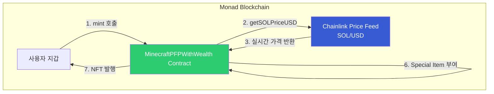
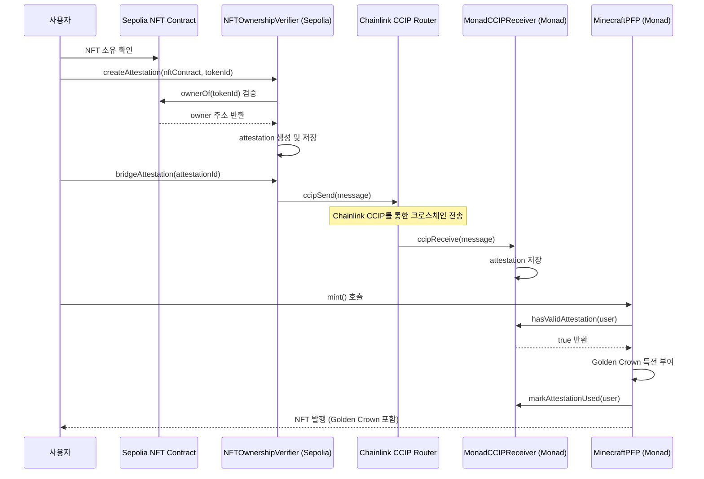

# Minecraft PFP NFT - Chainlink 통합 프로젝트

> **해커톤 심사역님께**: 이 프로젝트는 **Chainlink Price Feeds**와 **Chainlink CCIP**를 핵심 기능으로 활용하여, Minecraft 스타일 PFP NFT에 실시간 자산 기반 특성과 크로스체인 검증 시스템을 구현했습니다.

## 🎯 Chainlink 통합 개요

이 프로젝트는 Chainlink의 두 가지 핵심 기능을 통합하여 혁신적인 NFT 시스템을 구축했습니다:

### 1. Chainlink Price Feeds - 실시간 자산 기반 NFT 특성

사용자의 **실시간 자산 가치**를 온체인에서 계산하여 NFT에 특별한 아이템을 부여합니다.

- **실시간 가격 조회**: Chainlink Price Feed를 통해 SOL/USD 가격을 실시간으로 조회
- **자산 등급 시스템**: 총 자산 가치에 따라 6단계 등급 (None → Bronze → Silver → Gold → Platinum → Diamond)
- **특별 아이템 부여**: 자산 등급에 따라 Minecraft 스타일의 특별 아이템 지급

### 2. Chainlink CCIP - 크로스체인 NFT 소유권 검증

**Sepolia → Monad** 간 NFT 소유권 증명을 크로스체인으로 전송하여 특별 보너스를 부여합니다.

- **NFT 소유권 증명**: Sepolia에서 NFT 소유 여부를 검증하고 attestation 생성
- **CCIP 크로스체인 전송**: Chainlink CCIP를 통해 Monad로 안전하게 전송
- **Golden Crown 특전**: 검증된 사용자에게 황금 왕관 렌더링 특전 제공

---

## 📊 시스템 아키텍처

### Chainlink Price Feeds 통합 흐름



### Chainlink CCIP 크로스체인 통합 흐름



---

## 💻 핵심 구현 코드

### 1. Chainlink Price Feeds 통합

#### SOL/USD 실시간 가격 조회

`contracts/MinecraftPFPWithWealth.sol:118-123`

```solidity
/**
 * @dev SOL/USD 가격 조회
 * @return SOL 가격 (8 decimals)
 */
function getSOLPriceUSD() public view returns (uint256) {
    (, int256 price, , uint256 updatedAt, ) = solUsdPriceFeed.latestRoundData();
    require(price > 0, "Invalid SOL price");
    require(block.timestamp - updatedAt < PRICE_STALENESS_THRESHOLD, "Stale SOL price");
    return uint256(price);
}
```

#### 자산 가치 계산 및 Wealth Tier 결정

`contracts/MinecraftPFPWithWealth.sol:133-146`

```solidity
/**
 * @dev 주소의 총 자산 가치 계산 (SOL)
 * @param owner 조회할 주소
 * @return solValueUSD SOL의 USD 가치 (8 decimals)
 * @return totalValueUSD 총 자산의 USD 가치 (8 decimals)
 */
function calculateTotalWealth(address owner) public view returns (
    uint256 solValueUSD,
    uint256 totalValueUSD
) {
    // SOL 가치 계산
    uint256 solBalance = IERC20(SOL).balanceOf(owner);
    uint256 solPrice = getSOLPriceUSD();
    solValueUSD = (solBalance * solPrice) / 1e18;

    // 총 자산 계산
    totalValueUSD = solValueUSD;

    return (solValueUSD, totalValueUSD);
}
```

`contracts/MinecraftPFPWithWealth.sol:153-160`

```solidity
/**
 * @dev 자산 가치로부터 wealth tier 결정
 * @param totalValueUSD 총 자산 (USD, 8 decimals)
 * @return tier 자산 등급 (0-5)
 */
function getWealthTier(uint256 totalValueUSD) public pure returns (uint8) {
    if (totalValueUSD >= TIER_DIAMOND) return 5;    // $500,000+
    if (totalValueUSD >= TIER_PLATINUM) return 4;   // $100,000+
    if (totalValueUSD >= TIER_GOLD) return 3;       // $50,000+
    if (totalValueUSD >= TIER_SILVER) return 2;     // $10,000+
    if (totalValueUSD >= TIER_BRONZE) return 1;     // $1,000+
    return 0;
}
```

#### 민팅 시 Price Feed 활용

`contracts/MinecraftPFPWithWealth.sol:199-207`

```solidity
// 자산 가치 계산
(
    uint256 solValueUSD,
    uint256 totalValueUSD
) = calculateTotalWealth(msg.sender);

// Tier 및 Special Item 결정
uint8 tier = getWealthTier(totalValueUSD);
uint8 specialItem = getSpecialItemFromWealth(tier, msg.sender);
```

---

### 2. Chainlink CCIP 통합

#### NFT 소유권 증명 생성 (Sepolia)

`contracts/sepolia/NFTOwnershipVerifier.sol:100-139`

```solidity
/**
 * @notice NFT 소유권 attestation 생성
 * @dev NFT 소유 여부를 확인하고 attestation을 생성하여 온체인에 저장
 */
function createAttestation(
    address nftContract,
    uint256 tokenId
) external returns (bytes32 attestationId) {
    require(supportedNFTs[nftContract], "NFT not supported");

    // ERC721 소유권 검증
    IERC721 nft = IERC721(nftContract);
    address nftOwner = nft.ownerOf(tokenId);
    require(nftOwner == msg.sender, "Not the owner");

    // 고유 attestation ID 생성
    attestationId = keccak256(
        abi.encodePacked(
            msg.sender,
            nftContract,
            tokenId,
            nonces[msg.sender],
            block.timestamp
        )
    );

    // Nonce 증가
    nonces[msg.sender]++;

    // Attestation 저장
    attestations[attestationId] = Attestation({
        nftContract: nftContract,
        tokenId: tokenId,
        owner: msg.sender,
        timestamp: block.timestamp,
        blockNumber: block.number,
        sourceChainSelector: SEPOLIA_CHAIN_SELECTOR,
        attestationId: attestationId
    });

    emit AttestationCreated(attestationId, msg.sender, nftContract, tokenId);

    return attestationId;
}
```

#### CCIP를 통한 크로스체인 전송 (Sepolia)

`contracts/sepolia/NFTOwnershipVerifier.sol:149-203`

```solidity
/**
 * @notice CCIP를 통해 attestation을 Monad로 전송
 */
function bridgeAttestation(
    bytes32 attestationId,
    uint64 destinationChainSelector,
    address receiver
) external payable returns (bytes32 messageId) {
    Attestation memory attestation = attestations[attestationId];
    require(attestation.owner == msg.sender, "Not attestation owner");

    // NFT 소유권 재검증 (전송 후 브릿지 시도 방지)
    IERC721 nft = IERC721(attestation.nftContract);
    address currentOwner = nft.ownerOf(attestation.tokenId);
    require(currentOwner == msg.sender, "No longer the owner");

    // CCIP 메시지 데이터 인코딩
    bytes memory data = abi.encode(
        attestation.nftContract,
        attestation.tokenId,
        attestation.owner,
        attestation.timestamp,
        attestation.blockNumber,
        attestation.sourceChainSelector,
        attestationId
    );

    // CCIP 메시지 구성
    Client.EVM2AnyMessage memory message = Client.EVM2AnyMessage({
        receiver: abi.encode(receiver),
        data: data,
        tokenAmounts: new Client.EVMTokenAmount[](0),
        extraArgs: Client._argsToBytes(
            Client.EVMExtraArgsV1({gasLimit: 200_000})
        ),
        feeToken: address(0) // Native token으로 수수료 지불
    });

    // 수수료 계산
    uint256 fee = ccipRouter.getFee(destinationChainSelector, message);
    require(msg.value >= fee, "Insufficient fee");

    // CCIP 메시지 전송
    messageId = ccipRouter.ccipSend{value: fee}(
        destinationChainSelector,
        message
    );

    emit AttestationBridged(attestationId, destinationChainSelector, receiver, messageId);

    return messageId;
}
```

#### CCIP 메시지 수신 (Monad)

`contracts/monad/MonadCCIPReceiver.sol:115-179`

```solidity
/**
 * @notice CCIP 메시지 수신 (IAny2EVMMessageReceiver 구현)
 * @dev CCIP Router로부터만 호출 가능
 */
function ccipReceive(
    Client.Any2EVMMessage calldata message
) external override onlyRouter {
    _ccipReceive(message);
}

function _ccipReceive(
    Client.Any2EVMMessage memory message
) internal {
    // 송신자 주소 디코딩
    address sender = abi.decode(message.sender, (address));

    // 신뢰할 수 있는 Verifier인지 확인
    require(
        trustedVerifiers[message.sourceChainSelector][sender],
        "Untrusted verifier"
    );

    // Attestation 데이터 디코딩
    (
        address nftContract,
        uint256 tokenId,
        address owner,
        uint256 timestamp,
        uint256 blockNumber,
        uint64 sourceChainSelector,
        bytes32 attestationId
    ) = abi.decode(
        message.data,
        (address, uint256, address, uint256, uint256, uint64, bytes32)
    );

    // 중복 attestation 체크
    require(
        receivedAttestations[attestationId].owner == address(0),
        "Attestation already received"
    );

    // Attestation 저장
    receivedAttestations[attestationId] = ReceivedAttestation({
        nftContract: nftContract,
        tokenId: tokenId,
        owner: owner,
        timestamp: timestamp,
        blockNumber: blockNumber,
        sourceChainSelector: sourceChainSelector,
        attestationId: attestationId,
        receivedAt: block.timestamp,
        used: false
    });

    // 사용자의 최신 attestation 업데이트
    userToLatestAttestation[owner] = attestationId;

    emit AttestationReceived(
        attestationId,
        owner,
        sourceChainSelector,
        message.messageId
    );
}
```

#### 민팅 시 CCIP Attestation 확인 (Monad)

`contracts/MinecraftPFPWithWealth.sol:216-239`

```solidity
// CCIP Attestation 체크
if (ccipReceiver != address(0)) {
    // MonadCCIPReceiver 인터페이스를 통해 attestation 확인
    (bool success, bytes memory data) = ccipReceiver.staticcall(
        abi.encodeWithSignature("hasValidAttestation(address)", msg.sender)
    );

    if (success && data.length > 0) {
        bool hasAttestation = abi.decode(data, (bool));

        if (hasAttestation) {
            hasCCIPBonus[tokenId] = true;

            // Attestation 사용 처리
            (bool markSuccess, ) = ccipReceiver.call(
                abi.encodeWithSignature("markAttestationUsed(address)", msg.sender)
            );

            if (markSuccess) {
                emit CCIPBonusGranted(tokenId, msg.sender);
            }
        }
    }
}
```

`contracts/monad/MonadCCIPReceiver.sol:207-233`

```solidity
/**
 * @notice 사용자의 유효한 attestation 존재 여부 확인
 * @dev MinecraftPFP 컨트랙트에서 호출하여 특수 trait 부여 여부 결정
 */
function hasValidAttestation(address user) external view returns (bool) {
    bytes32 attestationId = userToLatestAttestation[user];

    // Attestation이 없으면 false
    if (attestationId == bytes32(0)) {
        return false;
    }

    ReceivedAttestation memory attestation = receivedAttestations[attestationId];

    // Owner가 일치하지 않으면 false
    if (attestation.owner != user) {
        return false;
    }

    // 이미 사용되었으면 false
    if (attestation.used) {
        return false;
    }

    // 만료되었으면 false (7일)
    if (block.timestamp > attestation.receivedAt + MAX_ATTESTATION_AGE) {
        return false;
    }

    return true;
}
```

---

## 🎨 주요 기능

### Chainlink Price Feeds 기반 자산 등급 시스템

| Tier | 자산 가치 | 특별 아이템 범위 |
|------|----------|----------------|
| None (0) | < $1,000 | 0 |
| Bronze (1) | $1,000+ | 1-3 |
| Silver (2) | $10,000+ | 4-6 |
| Gold (3) | $50,000+ | 7-10 |
| Platinum (4) | $100,000+ | 11-14 |
| Diamond (5) | $500,000+ | 15-19 |

### Chainlink CCIP 기반 크로스체인 검증

1. **Sepolia NFT 소유권 검증**: Sepolia에서 특정 NFT를 소유한 사용자가 attestation 생성
2. **CCIP 크로스체인 전송**: Chainlink CCIP를 통해 Monad로 안전하게 전송
3. **Golden Crown 특전**: Monad에서 NFT 민팅 시 황금 왕관 렌더링 특전 부여
4. **7일 유효기간**: Attestation은 수신 후 7일간 유효

---

## 🛠️ 기술 스택

### Smart Contract
- **Solidity 0.8.20**
- **Chainlink Price Feeds** (SOL/USD)
- **Chainlink CCIP** (Cross-chain Interoperability Protocol)
- OpenZeppelin ERC721URIStorage
- Hardhat

### Frontend
- Next.js 14 (App Router)
- TypeScript 5+
- Tailwind CSS
- Wagmi + RainbowKit
- Three.js (3D 렌더링)

### AI & Backend
- Anthropic Claude Haiku 4.5 (AI 스킨 생성)
- Supabase (데이터베이스)

---

## 📦 빠른 시작

### 1. 의존성 설치

```bash
pnpm install
```

### 2. 환경 변수 설정

```bash
cp .env.example .env
```

필수 환경 변수:
- `MONAD_TESTNET_RPC_URL`: Monad Testnet RPC URL
- `SEPOLIA_RPC_URL`: Sepolia RPC URL
- `PRIVATE_KEY`: 배포자 개인키
- `ANTHROPIC_API_KEY`: Anthropic Claude API 키
- Supabase 관련 키

### 3. 스마트 컨트랙트 배포

**Monad Testnet (메인)**
```bash
pnpm compile
pnpm deploy:monad
```

**Sepolia Testnet (CCIP)**
```bash
pnpm deploy:sepolia
```

### 4. 프론트엔드 실행

```bash
pnpm dev
```

브라우저에서 `http://localhost:3000` 접속

---

## 🌟 Chainlink 통합의 혁신성

### 1. Price Feeds - 실시간 자산 기반 NFT

기존 NFT는 정적인 특성만 가지지만, 이 프로젝트는:
- **실시간 자산 가치를 온체인에서 계산**하여 NFT에 반영
- **Chainlink Price Feed의 신뢰성**을 활용한 공정한 자산 평가
- **민팅 시점의 스냅샷 저장**으로 투명한 기록 유지

### 2. CCIP - 크로스체인 NFT 유틸리티

단순한 크로스체인 브릿지가 아닌:
- **NFT 소유권을 다른 체인에서 증명**하는 새로운 유틸리티
- **Chainlink CCIP의 보안성**을 활용한 안전한 크로스체인 메시징
- **실시간 상태 추적**으로 사용자 경험 향상

---

## 📚 참고 문서

- [전체 문서](./README_FULL.md) - 상세한 프로젝트 문서
- [Architecture](./ARCHITECTURE.md) - 시스템 아키텍처
- [Deployment Guide](./docs/DEPLOYMENT.md) - 배포 가이드
- [CCIP Implementation](./docs/CROSSCHAIN_NFT.md) - CCIP 구현 상세

---

## 📄 라이선스

MIT License

---

**이 프로젝트는 Chainlink Price Feeds와 CCIP를 활용하여 NFT에 실시간 자산 기반 특성과 크로스체인 유틸리티를 부여하는 혁신적인 시스템입니다.**
