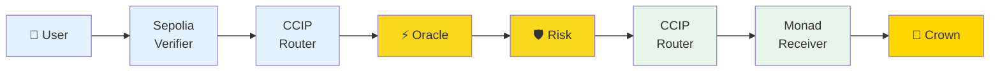
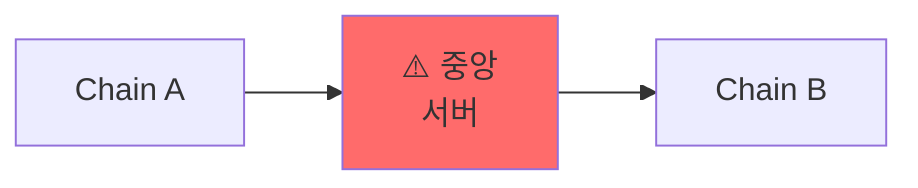
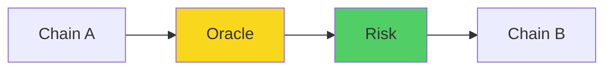
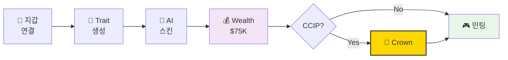
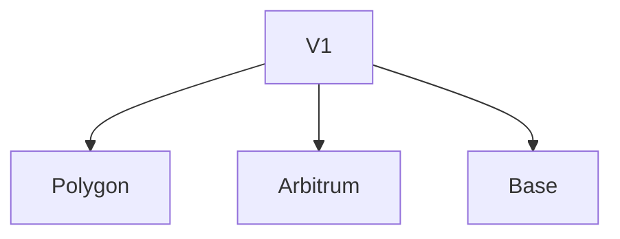
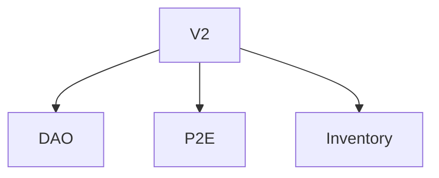
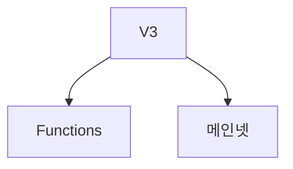

# 🎮 Minecraft PFP NFT
## AI + Chainlink 크로스체인 NFT

**Monad Blitz Hackathon 2025**

<div class="pt-12">
  <span @click="$slidev.nav.next" class="px-2 py-1 rounded cursor-pointer" hover="bg-white bg-opacity-10">
    Press Space <carbon:arrow-right class="inline"/>
  </span>
</div>

---
layout: center
---

# 🎯 한 줄 요약

<v-click>

> "지갑 주소로 생성된 고유 Minecraft NFT +
> **Chainlink CCIP**로 다른 체인 NFT 검증 → **황금 왕관** 👑"

</v-click>

---

# 💡 문제 & 솔루션

<div grid="~ cols-2 gap-4">
<div>

### ❌ 기존 PFP NFT
- 랜덤 생성 → 중복 가능
- 단일 체인 정체성
- 정적 메타데이터

</div>
<div>

### ✅ 우리의 해결책
- **결정론적 생성** (같은 주소 = 같은 NFT)
- **CCIP 크로스체인 검증**
- **동적 Wealth Tier**

</div>
</div>

---
layout: center
class: text-center
---

# ⭐ 핵심 #1
## Chainlink Data Feeds

---

# Wealth Tier 시스템

**문제**: NFT에 사용자의 "부"를 반영?

**해결**: Chainlink Price Feeds!

```solidity {1-3|5-6|8-9}
function calculateTotalWealth(address owner)
    public view returns (uint256 totalValueUSD)
{
    // Chainlink Price Feed 조회
    (, int256 ethPrice,,,) = ethUsdPriceFeed.latestRoundData();
    (, int256 usdtPrice,,,) = usdtUsdPriceFeed.latestRoundData();

    // USD 가치 계산
    totalValueUSD = (ethBalance * ethPrice) + (usdtBalance * usdtPrice);
}
```

---

# 등급별 특별 아이템

<div grid="~ cols-2 gap-4">
<div>

💎 **Diamond** ($500K+)
→ Elytra, Netherite

🥇 **Platinum** ($100K+)
→ Diamond Sword

</div>
<div>

🥈 **Gold** ($50K+)
→ Iron Armor

🥉 **Silver** ($10K+)
→ Bow, Shield

</div>
</div>

---
layout: center
class: text-center
---

# ⭐ 핵심 #2
## Chainlink CCIP 🌟

크로스체인 NFT 검증 → Golden Crown

---
layout: two-cols
---

# CCIP 아키텍처



::right::

<div class="pl-8">

### 9단계 프로세스

1. User → Sepolia 검증
2. NFT 소유권 확인
3. CCIP Router 전송
4. Oracle 검증
5. Risk Management
6. Monad Router 수신
7. Attestation 저장
8. AI 확인
9. **Golden Crown** 👑

</div>

---

# CCIP 메시지 흐름

<div grid="~ cols-2 gap-4">
<div>

### 📤 Sepolia 발신

```solidity {2-4|6-10}
// Step 1: NFT 확인
require(
  IERC721(nft).balanceOf(msg.sender) > 0
);

// Step 2: CCIP 전송
bytes32 messageId =
  IRouterClient(router).ccipSend(
    monadSelector, message
  );
```

</div>
<div>

### 📥 Monad 수신

```solidity {2-4|6-7}
// Step 3: CCIP 수신
function _ccipReceive(message)
    internal override
{
    address user = decode(message.data);
    // attestation 저장
    attestations[user] = true;
}
```

</div>
</div>

---
layout: two-cols
---

# 기존 vs CCIP

### ❌ 중앙화 브릿지



- 해킹 위험
- 단일 장애점
- 체인마다 다른 방식

::right::

<div class="pl-8">

### ✅ Chainlink CCIP



- 탈중앙화 검증
- 이중 보안
- 통일된 인터페이스

</div>

---

# 🎮 Demo: Alice의 여정



**5단계**: 연결 → Trait → AI → Wealth (Gold) → CCIP (Crown) → 민팅

---

# 🛠️ 기술 스택

<div grid="~ cols-3 gap-4">
<div>

### Smart Contracts
- Solidity 0.8.20
- OpenZeppelin
- **Chainlink** (Feeds + CCIP)
- Hardhat

</div>
<div>

### Frontend
- Next.js 14
- **Claude AI** (스킨 생성)
- Supabase (캐싱)
- Wagmi + RainbowKit

</div>
<div>

### 3D & Media
- Three.js
- skinview3d
- @napi-rs/canvas
- gif.js

</div>
</div>

---

# 🚀 향후 계획

<div grid="~ cols-3 gap-4">
<div>

### Q1 2025

체인 확장

</div>
<div>

### Q2 2025

거버넌스

</div>
<div>

### Q3-Q4 2025

완성

</div>
</div>

---
layout: center
class: text-center
---

# 🏆 왜 특별한가?

<v-clicks>

✅ **Chainlink 생태계 완벽 활용** (Feeds + CCIP)

✅ **실용적 크로스체인 유틸리티** (정체성 증명)

✅ **재미 + 기술 균형** (Minecraft + Web3)

✅ **확장 가능한 아키텍처** (무한 체인 통합)

</v-clicks>

---
layout: center
class: text-center
---

# 📊 핵심 성과

<div grid="~ cols-2 gap-8">
<div>

### Chainlink 통합
- ✅ Data Feeds (3개 토큰)
- ✅ CCIP (Sepolia ↔ Monad)
- 🔜 Functions (AI 자동화)

</div>
<div>

### 기술 혁신
- ✅ AI 픽셀 아트 자동 생성
- ✅ 결정론적 Trait 시스템
- ✅ 크로스체인 정체성

</div>
</div>

---
layout: end
class: text-center
---

# 감사합니다! 🎉

## "Chainlink CCIP로 연결된 미래를 만듭니다"

<div class="pt-8 text-xl">
<carbon-logo-github class="inline"/> GitHub · <carbon-network-3 class="inline"/> Demo · <carbon-chart-network class="inline"/> CCIP Explorer
</div>

<div class="abs-br m-6 flex gap-2">
  <a href="https://github.com/yourusername/minecraft-pfp" target="_blank" alt="GitHub"
    class="text-xl icon-btn opacity-50 !border-none !hover:text-white">
    <carbon-logo-github />
  </a>
</div>

---
layout: center
---

# 💬 Q&A

### 예상 질문

**Q: CCIP 수수료는?**
A: LINK 토큰으로 결제, 사용자는 가스비만 부담

**Q: 다른 체인 NFT도 검증 가능?**
A: 네! 모든 ERC721 NFT 가능

**Q: AI 생성 비용은?**
A: 요청당 ~$0.001, Supabase 캐싱으로 재생성 방지

**Q: 메인넷 마이그레이션?**
A: 동일 컨트랙트 배포 + CCIP 설정 업데이트만
