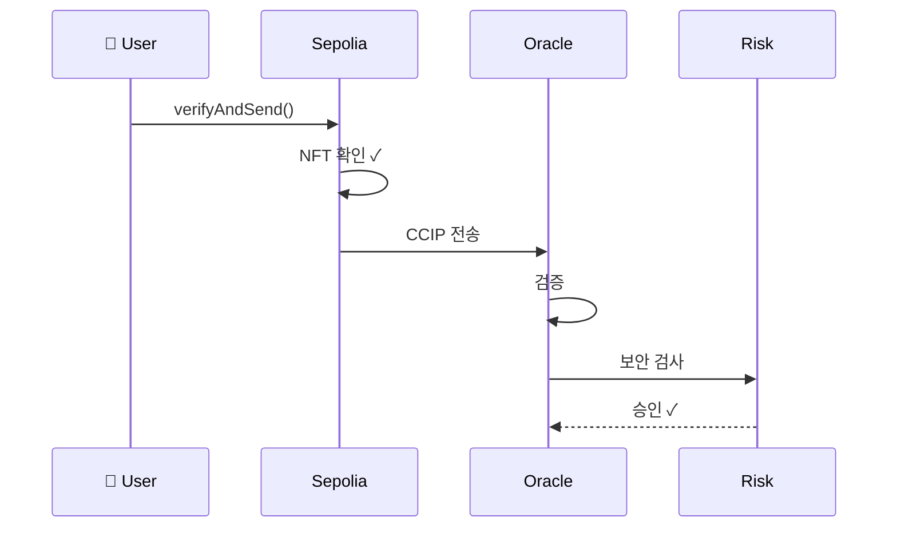
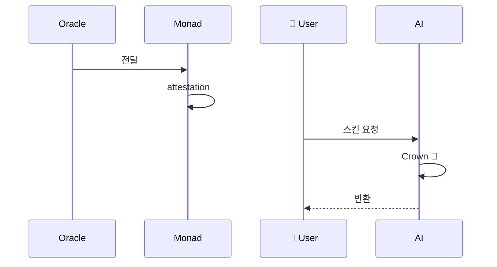
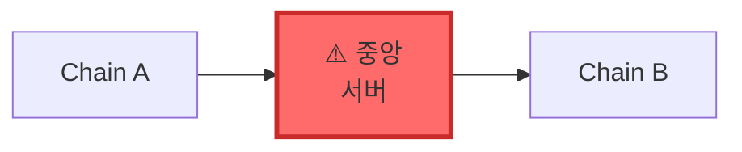
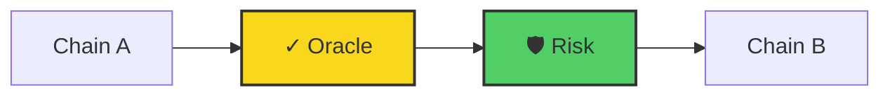
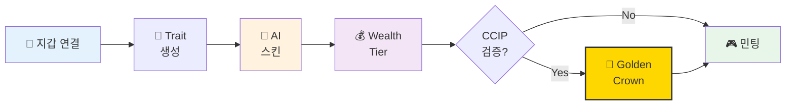
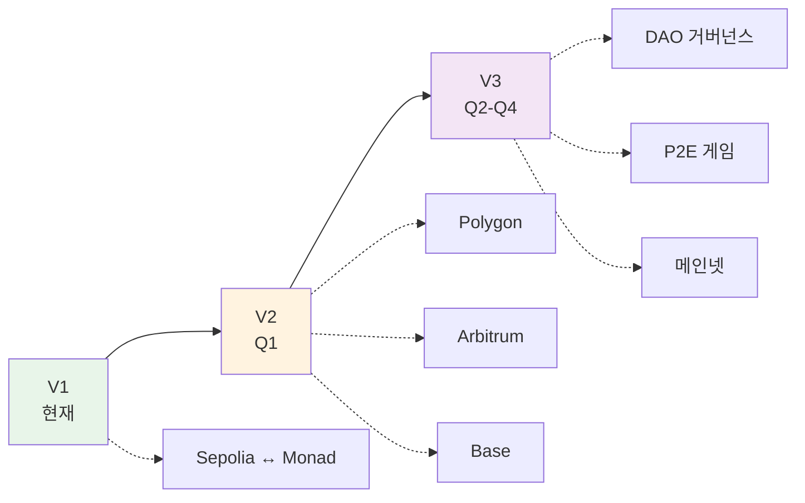

# 🎮 Minecraft PFP NFT
## AI + Chainlink로 만드는 재미있는 크로스체인 NFT

**Monad Blitz Hackathon 2025**

<div class="pt-12">
  <span @click="$slidev.nav.next" class="px-2 py-1 rounded cursor-pointer" hover="bg-white bg-opacity-10">
    Press Space for next page <carbon:arrow-right class="inline"/>
  </span>
</div>

---
layout: center
---

# 🎯 한 줄 요약

<v-click>

> "당신의 지갑 주소로 생성된 고유한 Minecraft 캐릭터 NFT에,
> **Chainlink CCIP**로 다른 체인의 NFT를 검증하면 **황금 왕관**을 씌워드립니다!"

</v-click>

---

# 💡 프로젝트 배경

<div grid="~ cols-2 gap-4">
<div>

### 기존 PFP NFT의 문제점
- ❌ 랜덤 생성 → 동일 지갑으로 다른 NFT 발행 가능
- ❌ 단일 체인에 갇힌 정체성
- ❌ 정적인 메타데이터

</div>
<div>

### 우리의 솔루션
- ✅ **결정론적 생성**: 같은 주소 = 같은 캐릭터
- ✅ **크로스체인 검증**: Chainlink CCIP로 다른 체인 자산 증명
- ✅ **동적 특전**: 자산 등급에 따른 특별 아이템

</div>
</div>

---
layout: center
---

# ⭐ 핵심 기능 #1
## Chainlink Data Feeds

---

# 자산 기반 Wealth Tier 시스템

**문제**: NFT에 사용자의 "부"를 어떻게 반영할까?

**해결**: Chainlink Price Feeds로 실시간 자산 가치 계산!

```solidity {1-5|7-10|12-14}
function calculateTotalWealth(address owner) public view returns (
    uint256 ethBalance,
    uint256 usdtBalance,
    uint256 usdcBalance,
    uint256 totalValueUSD
) {
    // Chainlink Price Feed 조회
    (, int256 ethPrice,,,) = ethUsdPriceFeed.latestRoundData();
    (, int256 usdtPrice,,,) = usdtUsdPriceFeed.latestRoundData();

    // USD 가치 계산
    totalValueUSD = (ethBalance * ethPrice) +
                    (usdtBalance * usdtPrice) + ...;
}
```

---

# Wealth Tier 특별 아이템

<div grid="~ cols-2 gap-4">
<div>

💎 **Diamond** ($500K+)
- Elytra, Netherite Armor

🥇 **Platinum** ($100K+)
- Diamond Sword, Enchanted Bow

</div>
<div>

🥈 **Gold** ($50K+)
- Iron Armor, Golden Apple

🥉 **Silver** ($10K+)
- Bow, Shield

</div>
</div>

---
layout: center
class: text-center
---

# ⭐ 핵심 기능 #2
## Chainlink CCIP 🌟

크로스체인 NFT 검증 → Golden Crown

---

# CCIP 아키텍처 개요

```mermaid {scale: 0.65}
graph LR
    A[👤 User<br/>NFT 소유] --> B[🔍 Verify<br/>Sepolia]
    B --> C[📡 CCIP<br/>Router]
    C --> D[⚡ Oracle<br/>Network]
    D --> E[🛡️ Risk<br/>Mgmt]
    E --> F[📡 CCIP<br/>Router]
    F --> G[✅ Receiver<br/>Monad]
    G --> H[💾 Attestation<br/>Storage]
    H --> I[👑 Golden<br/>Crown]

    style D fill:#f9d71c,stroke:#333,stroke-width:2px
    style E fill:#f9d71c,stroke:#333,stroke-width:2px
    style I fill:#ffd700,stroke:#333,stroke-width:2px

    classDef sepolia fill:#e3f2fd,stroke:#1976d2
    classDef monad fill:#e8f5e9,stroke:#388e3c
    classDef chainlink fill:#fff9c4,stroke:#f57f17

    class A,B,C sepolia
    class F,G,H,I monad
    class D,E chainlink
```



---

# CCIP 메시지 전달 과정

<div class="grid grid-cols-2 gap-4">
<div>

### 1-6단계: CCIP 검증



</div>
<div>

### 7-11단계: Monad 수신



</div>
</div>

---

# CCIP vs 기존 브릿지

<div class="grid grid-cols-2 gap-8">
<div>

### ❌ 기존 브릿지



- ❌ 중앙 서버 의존
- ⚠️ 해킹 위험 높음
- ❌ 체인마다 다른 방식

</div>
<div>

### ✅ Chainlink CCIP



- ✅ 탈중앙화 네트워크
- ✅ 이중 보안 검증
- ✅ 통일된 인터페이스

</div>
</div>

---

# Alice의 NFT 여정



**5단계**: 지갑 → Trait → AI → Wealth → CCIP → 민팅

---

# 🚀 향후 계획



**Q1**: Polygon, Arbitrum, Base 통합
**Q2-Q4**: DAO, P2E, Chainlink Functions, 메인넷

---
layout: center
class: text-center
---

# 🏆 왜 이 프로젝트가 특별한가?

<v-clicks>

✅ **Chainlink 생태계 완벽 활용** (Data Feeds + CCIP)

✅ **실용적 크로스체인 유틸리티** (정체성 증명)

✅ **재미 + 기술의 균형** (Minecraft + Web3)

✅ **확장 가능한 아키텍처** (무한한 체인 통합)

</v-clicks>

---
layout: end
class: text-center
---

# 감사합니다! 🎉

## "Chainlink CCIP로 연결된 미래를 만듭니다"

<div class="pt-12">
GitHub · Demo · CCIP Explorer
</div>
